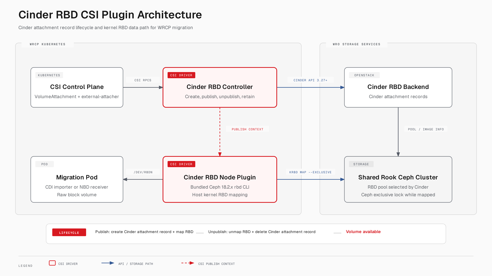

# Cinder RBD CSI Plugin for WRCP Migration

**Status:** Proposed design
**Driver name:** `cinder-rbd.csi.windriver.com`
**Author:** Wind River Migration Framework Team
**Date:** 2026-08-31

**Target baseline:** WRCP 24.09 and later (Kubernetes 1.29.2, Linux 6.6,
Rook Ceph 18.2.x)
**Node mapping method:** Kernel RADOS Block Device (`krbd`)
**Volume mode:** Raw block only, `SINGLE_NODE_WRITER`
**Minimum Cinder API microversion:** **3.27**; Cinder attachment record
completion uses microversion 3.44 when available

Related designs:
- `iscsi-backed-cinder-volume-for-wrcp-migration.md`
- `nfs-backed-cinder-volume-for-wrcp-migration.md`

---

## 1. Architecture choices and constraints

This document proposes a Container Storage Interface (CSI) driver for
using Ceph RADOS Block Device (RBD)-backed Cinder volumes during
workload migration to Wind River Cloud Platform (WRCP).

The driver uses:

1. **A Cinder attachment record to reserve the volume for the migration.**
2. **Kernel RBD (`krbd`) to map the volume on a worker node.**
3. **A Ceph exclusive lock while a node has a writable mapping.**
4. **A Cinder attachment record lifecycle tied to each migration pod:**
   the volume is reserved or in use while a pod uses it and returns to
   `available` after the pod is unpublished.

These choices match the validated WRCP 24.09 environment, where the platform's
Ceph-CSI already maps RBD volumes through the kernel and active devices
appear as `/dev/rbdN`.

The initial implementation uses the Ceph identity returned by Cinder —
normally `client.cinder` — with a Kubernetes Secret containing the
matching key duplicated by the platform operator from the existing
Ceph/Cinder deployment. A dedicated identity may be introduced later
only under the conditions in §6.

## 2. Problem statement and intended use

The migration workflows use Kubernetes pods to copy a source virtual
machine disk into a target Cinder volume. The VMware-to-OpenStack
(V2O) workflow uses KubeVirt CDI, while the OpenStack-to-OpenStack
(O2O) workflow uses the Network Block Device (NBD) protocol as an
application-level copy transport. Both workflows provision the target
volume as a Kubernetes raw-block PVC. CDI may create and remove several
temporary pods during the precopy and cutover phases.

The plugin coordinates two related lifecycles:

- **Control-plane lifecycle:** a Cinder attachment record reserves the
  target volume while a migration pod is attached. When the pod is
  deleted, `ControllerUnpublishVolume` removes the Cinder attachment
  record and returns the volume to `available`.
- **Node data-path lifecycle:** a node maps the Ceph RBD image only
  while a migration pod stages and uses the volume.

For a multi-phase CDI migration, the volume must return to `available`
after an importer pod is deleted. A later phase creates a new
attachment record when its replacement pod is published. Keeping a
Cinder attachment record across this interval can prevent the V2O
workflow from advancing. The node lifecycle follows the same boundary:
`NodeUnstageVolume` removes the kernel RBD mapping before the controller
deletes the Cinder attachment record.

This lifecycle matches the implemented cinder-iscsi driver at the CSI
controller boundary. The backend-specific cleanup differs:
cinder-iscsi deletes the Cinder attachment record to terminate a
per-initiator iSCSI target, while cinder-rbd first unmaps the RBD image
and releases its Ceph exclusive lock. In both cases,
`ControllerUnpublishVolume` deletes the current Cinder attachment
record and the next publish creates a new one.

## 3. Deployment assumptions and validated constraints

The following conditions were confirmed in the WRCP and Wind River
OpenStack (WRO) environment on which this design is based:

| Area | Validated result | Design consequence |
|---|---|---|
| Platform | WRCP 24.09, Kubernetes 1.29.2, Linux 6.6 | WRCP 24.09 is the minimum baseline |
| Ceph topology | WRCP Kubernetes and WRO Cinder use the same Rook-managed Ceph cluster | Cinder connection info identifies a locally reachable image |
| Ceph version | Rook Ceph 18.2.2; Ceph-CSI container tools 18.2.1 | Bundle a qualified Ceph 18.2.x `rbd` client in the plugin image |
| Existing Kubernetes path | Ceph-CSI uses `krbd`; active devices are `/dev/rbdN` | Use `krbd` as the default mapping method |
| Host tooling | Host `rbd` is Ceph 14.2.22 | Include a qualified Ceph 18.2.x `rbd` client in the plugin image |
| Ceph identities | Cinder uses `client.cinder`; Ceph-CSI uses separate CSI identities | The node key must match Cinder's returned `auth_username` |
| Cinder backend | Active volume type is `ceph-rook-store` | Read the volume type from the StorageClass; do not hard-code it |
| Cinder response | Cinder attachment update returns **flat** RBD connection fields | Parse the flat schema; tolerate nested `data` only for compatibility |
| Image naming | `name` is `cinder-volumes/<cinder-volume-uuid>` — no `volume-` prefix | Use Cinder's exact `name`; split only the first `/` |

## 4. Goals and non-goals

**Goals**
- Provision or adopt a Cinder RBD-backed volume as a Kubernetes
  raw-block PersistentVolume (PV).
- Keep the Cinder volume reserved while each migration pod uses it and
  return it to `available` between migration pods.
- Map the exact Cinder-selected RBD image on a WRCP worker using krbd.
- Preserve CSI idempotency across retries, pod replacement, plugin
  restart, and partial failures.
- Enforce one writable node mapping while the volume is actively staged.
- Retain the Cinder volume by default after the migration PVC is
  deleted so that the Wind River migration Blueprint (the orchestration
  workflow that creates the target workload) can attach it to the
  target virtual machine.
- Avoid Nova, a shadow VM, host Ceph client dependencies, and
  dynamically copied Ceph credentials.

**Non-goals**
- General-purpose replacement for the upstream Cinder CSI plugin.
- Filesystem-mode PVCs, ReadWriteMany (RWX) access, snapshots, clones,
  online expansion,
  topology-aware provisioning (see §12).
- Cross-Ceph-cluster replication.
- Automatic support for RBD image features the WRCP kernel cannot map.
- Permanent protection against privileged actors that bypass Cinder
  with direct Ceph credentials (see §13).

## 5. Architecture



*Figure 1: The controller creates and deletes a Cinder attachment
record for each migration pod. The node plugin maps the selected RBD
image through the host kernel and exposes the resulting block device
to the pod.*

### Separation of control and data planes

**Attachment terminology:** a Kubernetes `VolumeAttachment` resource
represents the Kubernetes request to attach a PV to a node. A Cinder
attachment record represents the reservation and connection lifecycle
in the OpenStack Block Storage service. A Cinder attachment ID
identifies that Cinder record. These terms are related but are not
interchangeable.

**Control plane:** Kubernetes creates a `VolumeAttachment` resource
when a pod that uses the PV is scheduled to a node. The CSI
external-attacher watches that resource and calls
`ControllerPublishVolume`. Inside the CSI driver, `CreateVolume`
creates the volume and an initial reserved **Cinder attachment record**.
`ControllerPublishVolume` updates that Cinder record with the selected
node's connector and obtains RBD connection information.

When the pod is deleted, Kubernetes deletes its `VolumeAttachment`
resource. The external-attacher then calls `ControllerUnpublishVolume`,
which deletes the Cinder attachment record and clears its ID from
Cinder volume metadata. The Cinder volume returns to `available`. If a
later migration phase publishes the volume again, the driver creates a
new Cinder attachment record on demand.

**Data plane:** the node plugin maps the RBD image with krbd during
`NodeStageVolume` and unmaps it during `NodeUnstageVolume`.
`NodePublishVolume`/`NodeUnpublishVolume` only create and remove the
raw-block bind target required by kubelet.

### Connection information contract

The validated response to a Cinder attachment update is **flat**:

```json
{
  "driver_volume_type": "rbd",
  "cluster_name": "ceph",
  "name": "cinder-volumes/<cinder-volume-uuid>",
  "auth_enabled": true,
  "auth_username": "cinder",
  "secret_type": "ceph",
  "secret_uuid": "<ceph-fsid>",
  "volume_id": "<cinder-volume-uuid>",
  "hosts": ["10.107.190.121", "10.106.210.60", "10.98.180.79"],
  "ports": ["6789", "6789", "6789"]
}
```

The driver must:
- Treat `name` as authoritative and split only the first `/` into pool
  and image. Never add a `volume-` prefix or assume the pool name.
- Validate `driver_volume_type == "rbd"`.
- Pair `hosts[n]` with `ports[n]`.
- Treat `secret_uuid` as an identifier (it equals the Ceph cluster
  identifier, or FSID, here), never as a key.
- Accept a nested `data` object only as a backward-compatible alternate
  representation.
- Return the normalized fields in `publish_context` for the current
  Kubernetes `VolumeAttachment`. A later migration pod obtains fresh
  connection information through a new Cinder attachment record.
- Never log a Ceph key or generated keyring.

## 6. Ceph authentication model

### Initial implementation

A namespace-scoped Kubernetes Secret contains a duplicate of the key
used by the existing Ceph/Cinder deployment for the identity returned
by Cinder:

```text
auth_username  = cinder
keyring entity = client.cinder
```

The WRCP operator also deploys this plugin and is responsible for
duplicating and rotating this Secret. No automated cross-deployment
secret synchronization is required for this internally used plugin.

**Operator procedure:**

1. Identify the operator-managed Secret or keyring source configured
   for the existing Ceph/Cinder deployment's `client.cinder` identity.
   Its name and location are deployment-specific.
2. Confirm that its Ceph cluster FSID matches the FSID returned by
   Cinder in `secret_uuid`.
3. Copy the `client.cinder` entity name and key into the plugin's
   namespace-scoped Kubernetes Secret. Follow the platform's documented
   credential-copy procedure; do not place the key in documentation,
   logs, or command-line history.
4. Configure the plugin with that Secret name and namespace.
5. Verify that the configured entity matches Cinder's
   `auth_username`, then test an RBD map, write, flush, unmap, and
   remap before enabling migration workloads.
6. When the source `client.cinder` key changes, duplicate the updated
   key into the plugin Secret and repeat the map test.

The plugin must not retrieve the key from a running Cinder pod, copy a
host keyring at runtime, or infer the key from `secret_uuid`. A mismatch
between the configured entity and `auth_username` causes publish to
fail with a clear error.

**Verified on a WRCP 24.09 lab.** The steps below were exercised end
to end against a live cluster (Kubernetes 1.29, Rook Ceph 18.2.2,
Cinder `ceph-rook-store` type) to confirm the procedure is correct.
Secret values are redacted; do not paste real keys into documentation.

1. Identify the source Secret. On WRCP 24.09 the existing
   `client.cinder` key already exists as a Kubernetes Secret, so no
   host keyring lookup is needed:

   ```console
   $ kubectl -n openstack get secret cinder-volume-rbd-keyring -o jsonpath='{.data.key}' | base64 -d
   AQ...redacted...==
   ```

2. Confirm the FSID matches Cinder's `secret_uuid`. The Ceph tools pod
   reports the cluster FSID:

   ```console
   $ kubectl -n rook-ceph exec deploy/rook-ceph-tools -- ceph fsid
   c5f7876d-258c-4152-b26a-a3ab532fda28
   ```

   A test volume's Cinder attachment `connection_info` returned the
   same value in `secret_uuid`, alongside `auth_username: cinder` and
   `driver_volume_type: rbd`:

   ```json
   {
     "name": "cinder-volumes/8ee6132d-c940-47b0-9df5-a9b7ecba2d2f",
     "hosts": ["10.107.190.121", "10.106.210.60", "10.98.180.79"],
     "ports": ["6789", "6789", "6789"],
     "auth_username": "cinder",
     "secret_uuid": "c5f7876d-258c-4152-b26a-a3ab532fda28",
     "driver_volume_type": "rbd"
   }
   ```

3. Copy the entity name and key into the plugin's namespace-scoped
   Secret, following the platform's approved credential-copy method
   (shown here only to illustrate the resulting Secret shape):

   ```console
   $ kubectl -n <plugin-namespace> create secret generic <plugin-secret-name> \
       --from-literal=userID=cinder \
       --from-literal=userKey=<redacted-key>
   ```

4. Configure the plugin with that Secret name and namespace (driver
   configuration reference, not yet finalized).

5. Confirm the configured entity matches `auth_username`, then test a
   map, write, flush, unmap, and remap. On the lab this was performed
   directly (krbd requires host kernel access, so this runs on a
   Kubernetes worker node, not inside a container):

   ```console
   $ rbd device map --device-type krbd --exclusive --cluster ceph \
       --id cinder --conf /etc/ceph/ceph.conf --keyring /etc/ceph/cinder.keyring \
       cinder-volumes/8ee6132d-c940-47b0-9df5-a9b7ecba2d2f
   /dev/rbd5

   $ dd if=/dev/zero of=/dev/rbd5 bs=1M count=4
   4+0 records in
   4+0 records out

   $ blockdev --flushbufs /dev/rbd5

   $ rbd device unmap /dev/rbd5
   ```

   The map, write, flush, and unmap all succeeded, and the image
   remapped cleanly afterward, confirming the duplicated key is
   sufficient for the full attach/detach cycle. Deleting the Cinder
   attachment returned the volume to `available`, matching the
   control-plane lifecycle described in Section 5.

6. When the source key changes, repeat step 3 and re-run the map test
   in step 5 before resuming migration workloads.

**Why not a dedicated least-privilege identity initially:** the krbd
map `--id` and the keyring must belong to the *same* identity.
Supplying a `client.wrcp-csi` key while mapping as `cinder` fails
authentication.

### Future dedicated identity

`client.wrcp-cinder-rbd-csi` is acceptable only when all of the
following conditions are met:
- explicit configuration overrides the connection username,
- the supplied key belongs to that exact identity,
- the identity has the required capabilities on the Cinder pool,
- exclusive-lock and blocklist recovery have been tested,
- the boundary is documented and accepted by the Ceph operator.

## 7. Kernel RBD node data path

### Why kernel RBD

- It is already the active WRCP Ceph-CSI data path (validated).
- It creates a kernel-owned `/dev/rbdN` device with **no userspace
  mapping process. Mappings therefore survive plugin pod restarts.
- The plugin image includes a qualified Ceph 18.2.x `rbd` CLI instead
  of using the host's older Ceph 14 CLI. The host kernel module
  implements the mapping.

### Map operation

The node plugin writes a temporary volume-specific `ceph.conf` (monitor
addresses from connection info) and a keyring from the Secret, then:

```bash
rbd device map \
  --device-type krbd \
  --exclusive \
  --cluster ceph \
  --id cinder \
  --conf    /run/cinder-rbd-csi/<volume-id>/ceph.conf \
  --keyring /run/cinder-rbd-csi/<volume-id>/keyring \
  cinder-volumes/<image-name>
```

`--exclusive` requires the image's `exclusive-lock` feature, which is
enabled by default for Cinder-created images on Ceph 18. The
qualification tests must confirm that the feature is present and that
a second writable mapping is rejected.

The implementation must not rely on the `/dev/rbdN` number remaining
constant. It records the returned path but reconciles ownership through
`rbd device list --format json` and sysfs identity before reusing or
unmapping a device.

Before publishing a writable device it verifies:
- mapped cluster/FSID matches the configured cluster,
- mapped pool and image exactly match Cinder's `name`,
- the mapping is exclusive and no conflicting writable client holds the
  lock,
- the block device is present with the expected size.

If exclusive mapping or lock acquisition fails, `NodeStageVolume`
fails. No silent fallback to non-exclusive mapping.

## 8. CSI lifecycle

### CreateVolume
1. Resolve the Cinder volume type from the StorageClass (the active
   WRCP type is `ceph-rook-store`; never hard-code).
2. Create the Cinder volume or reconcile an existing operation using
   the CSI request identity.
3. Wait until the volume is usable.
4. Create an initial reserved Cinder attachment record without a
   connector or Nova instance.
5. Store the Cinder attachment ID in Cinder volume metadata.
6. Return the Cinder volume UUID as the CSI volume ID.

### ControllerPublishVolume
1. Read the current Cinder attachment ID from Cinder volume
   metadata.
2. If no current Cinder attachment record exists, create one and store
   its ID. This is the expected path after a previous migration pod was
   unpublished.
3. Update the Cinder attachment record with the selected node's
   connector and obtain the RBD connection information.
4. If Cinder reports that the attachment record no longer exists,
   create a replacement record and retry the update once.
5. Complete the Cinder attachment record when Cinder supports
   microversion 3.44. Completion is optional because Cinder self-service
   attachment records and connection discovery require only
   microversion 3.27.
6. Normalize and return the non-secret connection fields in
   `publish_context`.

Each later CDI phase follows the same publish path and receives fresh
connection information from a newly created Cinder attachment record.

### ControllerUnpublishVolume
1. Read the current Cinder attachment ID from Cinder volume
   metadata.
2. Delete the Cinder attachment record if it exists.
3. Remove the Cinder attachment ID from volume metadata.
4. Return success after the Cinder volume reaches `available`.

This operation is intentionally tied to the pod lifecycle. When CDI
deletes an importer pod between migration phases, the volume must
become `available` before the workflow creates and publishes the next
pod.

### NodeStageVolume
1. Validate block mode and `SINGLE_NODE_WRITER`.
2. Load and validate `publish_context`.
3. Reconcile any existing mapping for the same cluster/pool/image
   (idempotency by live-map identity, not by staging file).
4. If absent, map with `krbd --exclusive` (§7).
5. Verify mapping identity and size.
6. Atomically write the staging record: volume ID, FSID, pool, image,
   device path, map generation.

### NodePublishVolume / NodeUnpublishVolume
Standard raw-block target exposure/removal; verify the target resolves
to the staged mapping. No Cinder interaction.

### NodeUnstageVolume
1. Verify no remaining publish targets reference the staged device.
2. Reconcile the current map by cluster/pool/image; confirm the device
   still belongs to this volume (a recycled `/dev/rbdN` number must
   never be unmapped without identity verification).
3. Unmap; confirm absence; remove the staging record.

A missing staging file is **not** proof that a mapping is absent —
always reconcile live kernel maps.

### DeleteVolume
1. Confirm no node mapping remains, or return a retryable error.
2. Delete the current Cinder attachment record if its ID remains in
   Cinder volume metadata.
3. Wait until the volume leaves `in-use`/`reserved`.
4. By default, **retain** the volume and remove only CSI ownership
   metadata so that the Wind River migration Blueprint can attach it to
   the target virtual machine. Delete the volume
   only when the explicit cleanup policy is enabled (per-volume
   `csi.cleanupVolume` override or driver-level mode, as in the iSCSI
   plugin).

### Controller state machine

```text
NEW
 | Create Cinder volume
 v
VOLUME_AVAILABLE
 | Create initial or on-demand Cinder attachment record
 v
RESERVED
 | Update connector, capture connection_info
 v
POD_USING_VOLUME (reserved or in-use)
 | NodeUnpublish + NodeUnstage
 | ControllerUnpublish deletes Cinder attachment record
 v
VOLUME_AVAILABLE
 |                               |
 | next migration pod            | DeleteVolume
 | creates new Cinder record     v
 +-----------------------> RESERVED   RETAINED_VOLUME (default)
                                      or DELETED_VOLUME (explicit cleanup)
```

## 9. Cinder attachment ID metadata and recovery

The current Cinder attachment ID is stored in Cinder volume
metadata:

```text
csi.rbd.attachment_id = <last-known-attachment-uuid>
```

The metadata value is the controller's current Cinder attachment ID.
The Cinder attachment ID returned in the PV's
immutable volume context must not be used after an unpublish operation
because it refers to a deleted Cinder record. If the metadata is
missing, `ControllerPublishVolume` creates a new Cinder attachment
record. If the metadata points to a record that Cinder no longer has,
the controller creates a replacement and retries the connector update
once.

## 10. Node state and crash recovery

The node plugin keeps a durable staging record under the CSI plugin
directory. The record helps recovery, but the current kernel and Ceph
state remains authoritative.

During startup, the node plugin compares every driver-owned staging
record with `rbd device list --format json` and verifies the pool and
image through sysfs. It recreates a missing target link when the
mapping is valid and marks the volume as unstaged when the mapping is
absent. If a device does not match the recorded identity, the plugin
reports and isolates the conflict instead of unmapping the device.
The plugin adopts an unrecorded but matching live mapping only after it
validates the Cinder attachment record and driver ownership.

| Failure | Required behavior |
|---|---|
| Volume created, reservation not created | Retry `CreateVolume`; find by request identity, create reservation |
| Reservation created, metadata write failed | On publish, find the reserved Cinder attachment record and restore its metadata before creating another record |
| Cinder attachment update succeeded, RPC response lost | Find the existing Cinder attachment record and recover normalized connection data |
| Map succeeded, staging record write failed | Detect the map by pool/image and adopt it after ownership validation |
| Plugin restart with live map | Reconcile and reuse the same kernel mapping |
| Node crash | Reconcile kernel map, staging records, and Cinder attachment record |
| Exclusive map denied | Fail `NodeStageVolume`; never fall back to a non-exclusive mapping |
| Conflicting Cinder attachment record | Fail without changing the record and require operator resolution |
| Unmap timeout | Keep staging state, return retryable failure |
| Cinder API unavailable during unstage | Node unmap may proceed; `ControllerUnpublishVolume` remains pending and retries until it can delete the Cinder attachment record |

## 11. Security, deployment, configuration

The node DaemonSet requires a privileged container, or an equivalent
validated set of Linux capabilities and device permissions. It also
requires access to the host's `/dev` directory, the relevant `/sys`
paths for RBD identity checks, the kubelet plugin and pod-volume paths,
and a private writable runtime directory for generated Ceph
configuration and staging records. Access to the credential Secret
must be limited to the driver service account.

The design does not require the host PID namespace, host
`/usr/bin/rbd*` binaries, or host `/etc/ceph` credentials.

Generated keyrings use restrictive permissions and are removed when no
longer needed. Credentials never appear in `publish_context`, logs,
annotations, or volume metadata.

**Configuration example:**

```ini
[Global]
cloud-config=/etc/kubernetes/cloud.conf
driver-name=cinder-rbd.csi.windriver.com
cinder-min-microversion=3.27
retain-volume=true

[RBD]
mounter=krbd
exclusive=true
expected-cluster-name=ceph
expected-fsid=<per-deployment Ceph FSID>
ceph-client-version-major=18
credential-secret-name=cinder-rbd-ceph-client
credential-secret-namespace=kube-system
map-timeout=120s
unmap-timeout=120s
```

The Ceph cluster identifier (FSID) is environment-specific and must be
configured for each deployment. It is not a credential.

**CDI StorageProfile:** as with the iSCSI plugin, each StorageClass
requires a CDI StorageProfile with `ReadWriteOnce` access and
`volumeMode: Block`. Without this profile, CDI creates filesystem-mode
PVCs, which this block-only driver rejects.

## 12. Supported capabilities

The initial release advertises `CREATE_DELETE_VOLUME`,
`PUBLISH_UNPUBLISH_VOLUME`, `SINGLE_NODE_WRITER`, and raw block mode.
Volume expansion is excluded unless it is designed and tested
separately.

Not initially advertised: filesystem volumes, snapshots, clones,
multi-node writer/reader, online expansion, topology-aware provisioning.

`NodeGetInfo.MaxVolumesPerNode` reflects the mapping limits validated
for the target platform.

Logs and metrics use non-secret identifiers only: CSI volume ID,
Cinder volume UUID, Cinder attachment ID, node ID, Ceph cluster
FSID, pool/image, device path, and lifecycle state. Recommended metrics
cover Cinder API latency and failures, Cinder attachment record creation
and cleanup, duplicate or conflicting Cinder attachment records, map
and unmap latency,
exclusive-lock failures, orphaned mappings or staging records, and
volumes retained or deleted.

## 13. Volume state between migration pods

While a migration pod uses the volume, the Cinder attachment record
keeps the volume in `reserved` or `in-use` state, and the krbd exclusive
lock prevents a second writable Ceph mapping.

When the pod is deleted, the CSI unpublish sequence removes both forms
of ownership: `NodeUnstageVolume` unmaps the RBD image and
`ControllerUnpublishVolume` deletes the Cinder attachment record. The
Cinder volume then returns to `available` even though the PVC and PV
continue to exist. This state is required between CDI migration phases
so that the V2O workflow can advance. The next migration pod causes
`ControllerPublishVolume` to create a new Cinder attachment record
before the node maps the image again.

During the interval in which the volume is `available`, normal
operational controls must prevent unrelated users from attaching or
deleting it. The CSI driver does not hold a Cinder attachment record or
a Ceph exclusive lock between migration pods.

## 14. Alternatives considered

| Alternative | Decision and rationale |
|---|---|
| Use the host's `rbd` CLI | Not selected. The host provides Ceph 14 tooling while the storage cluster runs Ceph 18.2.x. The plugin image will include a qualified Ceph 18.2.x client. |
| Keep one Cinder attachment record for the entire PVC lifetime | Not selected. CDI pod deletion must return the volume to `available` so the V2O workflow can continue. Each later pod receives a new Cinder attachment record. |
| Use a dedicated Ceph client immediately | Deferred. The initial implementation uses the identity returned by Cinder. A dedicated identity requires an explicit username override, a matching key, and validation of its pool and blocklist permissions. |
| Reuse the Cinder attachment ID stored in the PV volume context | Not selected. The PV context is immutable and becomes stale after unpublish. The current Cinder attachment ID is stored in Cinder volume metadata. |
| Rely only on the CSI access mode for single-writer behavior | Not selected. Writable mappings also use the Ceph exclusive-lock feature. |

## 15. Qualification requirements

### Already validated

The following conditions have already been validated on WRCP 24.09:

- Existing Ceph-CSI volumes use the kernel RBD data path.
- The active Cinder volume type is `ceph-rook-store`.
- Cinder returns `driver_volume_type=rbd` and flat connection
  information.
- The image name has the form `<pool>/<uuid>` without an added
  `volume-` prefix.
- Cinder returns `auth_username=cinder`, and `secret_uuid` identifies
  the Ceph cluster FSID.
- The Ceph-CSI image includes Ceph 18.2.x tools.
- WRCP Kubernetes and WRO Cinder use the same Ceph cluster.

### Required before production use
1. Build a minimal node image with the qualified Ceph 18.2.x `rbd` CLI.
2. Duplicate the existing platform `client.cinder` key into the
   plugin's namespace-scoped Secret and verify that its FSID and entity
   match Cinder connection information.
3. Map a Cinder image using the exact returned connection fields and
   the duplicated `client.cinder` Secret.
4. Write, read, flush, unmap, and remap the volume, and verify data
   integrity.
5. Confirm `--exclusive` blocks a second writable client.
6. Verify recovery after a node-plugin restart while a mapping is active.
7. Verify recovery after a node reboot.
8. Create a reserved Cinder attachment record without a Nova server or
   instance UUID.
9. Update a Cinder attachment record with microversion 3.27 and, when
   supported, complete it with microversion 3.44.
10. Verify each CDI pod deletion removes the Cinder attachment record and
   returns the volume to `available`; verify the next pod creates a new
   Cinder attachment record.
11. Inject failures after each external side effect and verify
    idempotent recovery.
12. Create duplicate driver-owned Cinder attachment records and verify
    safe reconciliation.
13. Test source-key rotation into the plugin Secret and insufficient
    Ceph permissions.
14. Verify that Secret data never appears in logs, CSI responses, or
    metadata.
15. Test the complete precopy and cutover workflow with pod movement
    between nodes.

Requirements 2, 3, 5, 8, 9, and 10 are mandatory before implementation
work proceeds beyond qualification.

## 16. Implementation plan

1. **Controller foundation** — reuse the cinder-iscsi Cinder client and
   CSI scaffolding; add strict RBD connection normalization; require
   microversion 3.27; create Cinder attachment records on demand; delete
   them during unpublish; and recover from stale Cinder attachment ID
   metadata.
2. **Kernel RBD node path** — node image with Ceph 18.2.x tools;
   generated `ceph.conf` + protected keyring handling; exclusive
   mapping; live-map/sysfs reconciliation; raw-block stage/publish.
3. **Recovery and lifecycle** — durable staging records; node startup
   reconciliation; fault injection around every side effect; repeated
   publish/unpublish cycles; and retain-by-default deletion.
4. **Qualification** — complete all requirements in Section 15; test
   multi-stage CDI migrations, plugin restarts, node reboots, pod
   rescheduling, Cinder API outages, and Ceph monitor disruptions; and
   provide an operator runbook for conflicting Cinder attachment
   records and isolated mappings.

Package layout mirrors the cinder-iscsi plugin (`pkg/csi/cinder-rbd/`,
`cmd/cinder-rbd-csi-plugin/`, chart, manifests, examples, release
workflow) with the node layer replaced by an `RBDMapper` abstraction
(`Map`/`Unmap`/`ListMapped`/`VerifyIdentity`) over the bundled `rbd`
CLI.

## 17. References

- Related iSCSI design:
  `iscsi-backed-cinder-volume-for-wrcp-migration.md`
- Related NFS design:
  `nfs-backed-cinder-volume-for-wrcp-migration.md`
- Cinder attachments API:
  https://docs.openstack.org/api-ref/block-storage/v3/#attachments
- Ceph RBD command reference: https://docs.ceph.com/en/reef/man/8/rbd/
- Ceph exclusive locks:
  https://docs.ceph.com/en/reef/rbd/rbd-exclusive-locks/
- Ceph user management:
  https://docs.ceph.com/en/latest/rados/operations/user-management/
- CVE-2020-10755 — keyring removed from RBD connection_info
